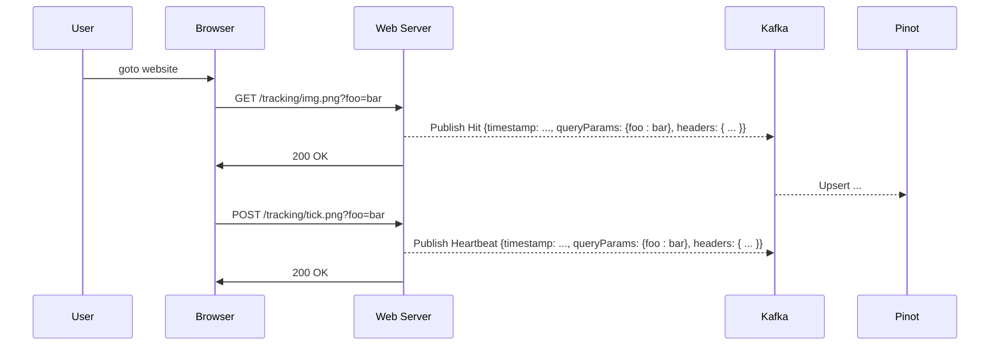

# About
This project was created to just kick the tyres of Apache Pinot, and to present a few  widgets in our ["data mesh"](https://kindservices.github.io/idea-labs/data-mesh/about.html) dashboard.

## Tracking Pixel

It simulates a simple "tracking pixel" used for identifying traffic to a website, and then related business queries reporting on that traffic by "the business" (e.g. website owners):

For the analytics portion of this demo, we'll want to emulate a "tracking pixel" emplanted on websites:

That request for a small, single-byte 1x1 image is the tracking pixel. The act of making that request to the server is tracked and used to inform the website owner who is visiting the website, from where, and for how long.

In this project, rather than include our own REST endpoint for serving a tracking pixel, we've instead used the [Kafka Rest Proxy](https://docs.confluent.io/platform/current/kafka-rest/api.html) with a little [test widget](./kafka-test-widget/README.md) to push data into Kafka.

The reason being that this is just for demo purposes, and a test/demo widget is always nice to have as well. (People can just use their imaginations for now that we can do the same thing by parsing a web request for a 1x1 tracking pixel)

# Building Locally

These components all run on Kubernetes, which we assume you have installed (see ['local-kubernetes'](https://github.com/kindservices/local-kubernetes) to get started with that.)