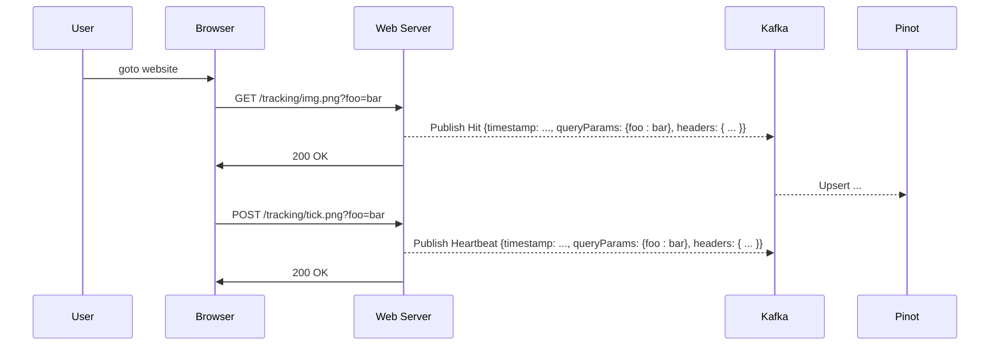
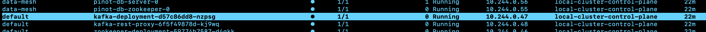
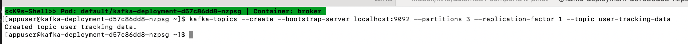
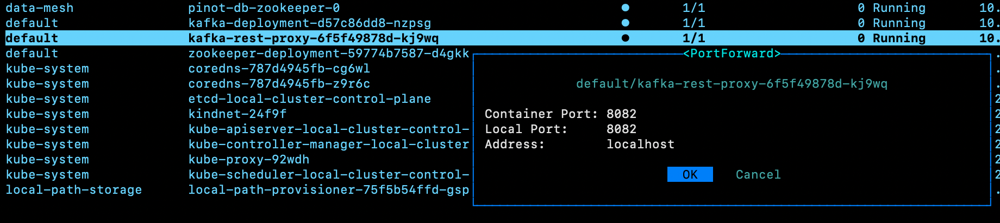
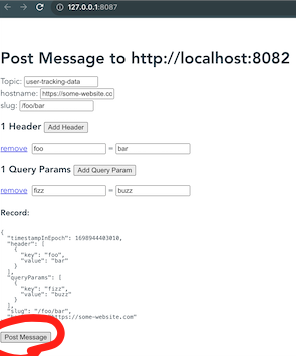
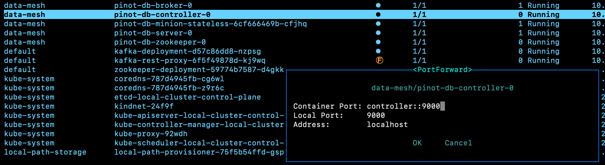
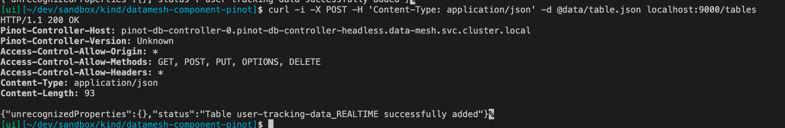
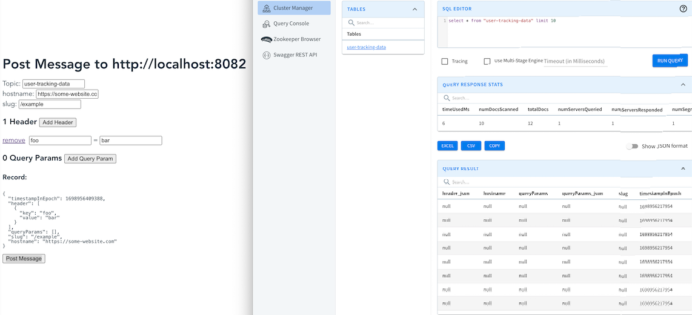

[Github Pages](https://kindservices.github.io/datamesh-component-pinot/) | [Github](https://github.com/kindservices/datamesh-component-pinot) | [Kind](https://www.kindservices.co.uk)

# Table of Contents
1. [About](#about)
2. [Building Locally](#building-locally)

    > [Setting up Kafka](#setting-up-kafka)

    [Creating the Kafka Topic](#creating-the-kafka-topic)

    [Pushing Data Into Our Kafka Topic](#pushing-data-into-our-kafka-topic)

    > [Setting Up Pinot](#setting-up-pinot)

    [Creating a Pinot Table](#creating-a-pinot-table)

    [Querying Pinot](#querying-pinot)


# About
This project was created to kick the tyres of Apache Pinot, and to present a few widgets in our ["data mesh"](https://kindservices.github.io/idea-labs/data-mesh/about.html) dashboard.

It simulates a simple "tracking pixel" used for identifying traffic to a website, and then related business queries reporting on that traffic by "the business" (e.g. website owners):

For the analytics portion of this demo, we'll want to emulate a "tracking pixel" emplanted on websites:



That request for a small, single-byte 1x1 image is the tracking pixel. The act of making that request to the server is tracked and used to inform the website owner who is visiting the website, from where, and for how long.

In this project, rather than include our own REST endpoint for serving a tracking pixel, we've instead used the [Kafka Rest Proxy](https://docs.confluent.io/platform/current/kafka-rest/api.html) with a little [test widget](./kafka-test-widget/README.md) to push data into Kafka.

The reason being that this is just for demo purposes, and a test/demo widget is always nice to have as well. (People can just use their imaginations for now that we can do the same thing by parsing a web request for a 1x1 tracking pixel)

# Building Locally

These components all run on Kubernetes, which we assume you have installed (see ['local-kubernetes'](https://github.com/kindservices/local-kubernetes) to get started with that.)


## Setting up Kafka

With our Kafka and PinotDB running, we need to:
 * create a Kafka topic and
 * create a Pinot schema and table


### Creating the Kafka Topic
Eventually we'll need this as Infrastructure as Code - perhaps with a K8S Job as part of our Argo deployment or (perhaps better) as an init container for our web test component.

For now, we'll create the topic manually. With Kafka deployed, select your kafka broker:



Then hit 's' to open a shell. With the shell open, run the following command:
```bash
kafka-topics --create --bootstrap-server localhost:9092 --partitions 3 --replication-factor 1 --topic user-tracking-data
```
Which should display 'Created topic user-tracking-data':



Success! We can type `exit` to get out of the shell.


**NOTE:**
It's also super-helpful to open a shell into a broker for debugging as well. 
You can see what messages are coming through the topic using the [kafka-console-consumer](https://kafka.apache.org/quickstart) tool:
```bash
kafka-console-consumer --bootstrap-server localhost:9092 --from-beginning --property print.key=true --topic user-tracking-data
```

### Pushing Data Into Our Kafka Topic

Out kafka deployment also spun up the kafka rest proxy, which our [kafka-test-widget](./kafka-test-widget/README.md) will use to push test data into our new topic.

If we open K9S again, we can choose the kafka-rest-proxy component and use 'shift+f' to [port-forward](https://kubernetes.io/docs/tasks/access-application-cluster/port-forward-access-application-cluster/) the service to our localhost:8082:



Now we can run our really ugly [kafka-test-widget](./kafka-test-widget/README.md) locally:

```bash 
cd kafka-test-widget && make dev
```



Success!

## Setting up Pinot

With Kafka running with our new topic in place and a means to push data into it,
we can now configure our "sink" for that data - our Apache Pinot Database.

### Creating a Pinot Table

With out topic in hand and pinot running, we can also port-forward to a pinot controller at port 9000:



You can see the controller REST API's Swagger file at [localhost:9000/help#/Table/alterTableStateOrListTableConfig](http://localhost:9000/help#/Table/alterTableStateOrListTableConfig)

```bash
curl -F schemaName=@pinotdb/schema.json  localhost:9000/schemas

curl -i -X POST -H 'Content-Type: application/json' -d @pinotdb/table.json localhost:9000/tables
```



And then, using our kafka test widget tool, we can see data going into pinot!



# Querying Pinot

The Pinot Broker handles [queries](https://docs.pinot.apache.org/users/api/querying-pinot-using-standard-sql), so we can port-forward (that old chestnut) to localhost:8099, then run e.g.:

```
curl -H "Content-Type: application/json" -X POST \
   -d '{"sql":"select * from usertrackingdata limit 100"}' \
   http://localhost:8099/query/sql
```


# Debugging

To check service connectivity in K8S, you can use BusyBox container:
```bash
kubectl run -i --tty --rm debug --image=alpine:latest --restart=Never -- sh
apk --no-cache add curl

```