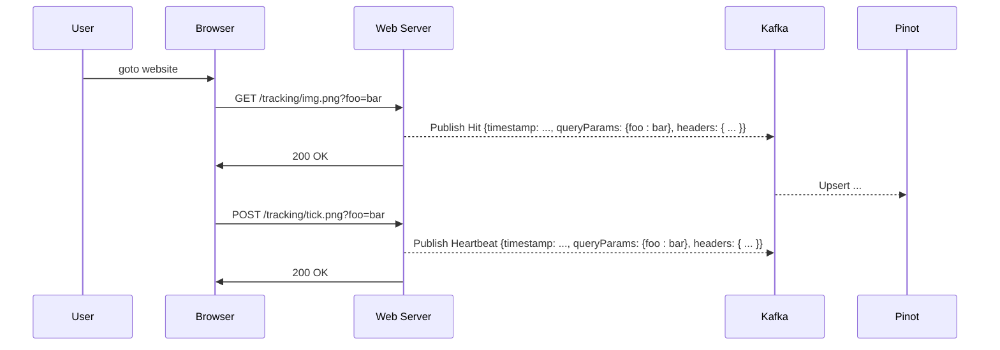

# Data

For the analytics portion of this demo, we'll want to emulate a "tracking pixel" emplanted on websites:



That request for a small, single-byte 1x1 image is the tracking pixel. The act of making that request to the server is tracked and used to inform the website owner who is visiting the website, from where, and for how long.

For this lab, we could actually create the REST service which serves the tracking pixel, but we could just as easily create a little test UI which allows us to push data into Kafka.

## Data Model
The salient points of information we'll want to track are:
 * timestamp
 * hostname
 * slug (the part of the URL after the host)
 * query params (the arbitrary key/value pairs in the web query)

 You can see how these fields are defined in our pinot DB in the [schema](./k8s/pinot-schema.yaml)

 ## Creating the table in pinot

With pinot running, we port-forward to a pinot controller at port 9000 (e.g. use k9s, then shift+f to port-forward)

You can see the controller REST API's Swagger file at [localhost:9000/help#/Table/alterTableStateOrListTableConfig](http://localhost:9000/help#/Table/alterTableStateOrListTableConfig)

```bash
curl -F schemaName=@schema.json  localhost:9000/schemas

curl -i -X POST -H 'Content-Type: application/json' -d @table.json localhost:9000/tables
```


### Alternative

 Following [this reference](https://docs.pinot.apache.org/basics/getting-started/pushing-your-streaming-data-to-pinot), and assuming we've successfully ran `make installArgo` in our `pinotdb` subdirectory, we will shell into a Pinot broker (using K9S), then execute:

 ```
 bin/pinot-admin.sh AddTable \
    -schemaFile /tmp/pinot-quick-start/transcript-schema.json \
    -tableConfigFile /tmp/pinot-quick-start/transcript-table-realtime.json \
    -exec
```