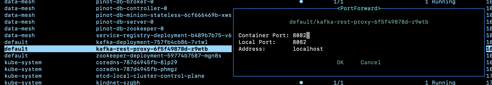

# Kafka Test Widget


This project is a simple Kafka UI which allows users (typically developers and testers) to easily push some test data into kafka.

It communicates with Kafka using the [Kafka Rest Proxy](https://docs.confluent.io/platform/current/kafka-rest/api.html#topics).

You can also use the command-line for setting up topics. The kubernetes/platform code for kafka is [here](../kafka/kafka-utils.md)

## Running / Testing 
See the [Makefile](./Makefile) for build targets, such as:

```bash
make dev
```

**Dependency:**
To build/run locally. If you open the `127.0.0.1:????` address in your browser, it will assume a connection to a locally running, port-forwarded kafka-rest accessible on localhost:8082:



## Testing the built image

If you're using `make installArgo` to deploy the built kafka-test-widget, it's side-car will assume a running [Service Registry](https://github.com/kindservices/datamesh-service-registry) to register the component against.

It will also serve up its web component bundle.js and bundle.css, so if you port-forward that container, you should be able to use eg [./test/local-test.html](./test/local-test.html) to test the web-componet UI.


# References
See [here](https://www.colorglare.com/svelte-components-as-web-components-b400d1253504)
and [here](https://medium.com/javascript-by-doing/how-to-create-a-web-component-in-svelte-5963356ec978)