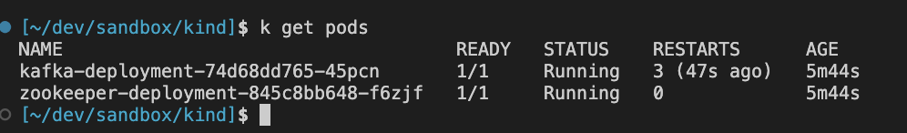

# Installing Kafka on K8S

We followed [this excellent write-up from datumo](https://www.datumo.io/blog/setting-up-kafka-on-kubernetes).


## Trying locally
With kubectl already running, you can just cd in to the kafka/k8s directory and run:

```
kubectl apply ./kafka.yaml
```

And then create a topic as per the datumo docs. Rather than `kubectl exec`, we can just use k9s to select the broker and choose `s` to open a shell.



```
kafka-topics --create --bootstrap-server localhost:9092 --partitions 3 --replication-factor 1 --topic example-topic

kafka-console-consumer --bootstrap-server localhost:9092 --topic example-topic
```

And now publish some messages:
```
kubectl run --rm -it debug-pod --image=python:3.9 -- bash
```

Then install confluent-kafka and fire up python:

```bash
pip install confluent-kafka --quiet
python
```

```bash
from confluent_kafka import Producer
import socket

conf = {"bootstrap.servers": "kafka-service:9092", "client.id": socket.gethostname()}

producer = Producer(conf)
producer.produce("example-topic", key="message", value="message_from_python_producer")
```


## Other

### Testing connectivity

```
kubectl run -it --rm debug-container --image=alpine:latest -- sh

nslookup my-service.default.svc.cluster.local
```

### Helm
These are the commands recommended from confluence when using helm:

```
helm repo add confluentinc https://confluentinc.github.io/cp-helm-charts/
helm repo update

helm install my-confluent confluentinc/cp-helm-charts -f values.yaml --namespace data-mesh --create-namespace


helm install confluentinc/cp-helm-charts --version 0.6.0
```