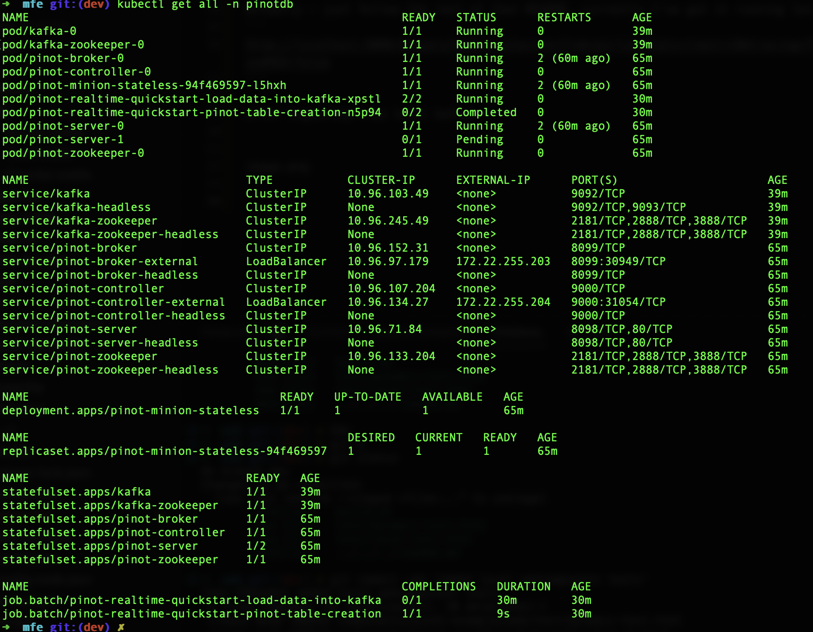

# Local Links
 * [pinot dashboard](http://localhost:9000/#/query?query=select+*+from+airlineStats+limit+10&tracing=false&useMSE=false)
 * [java client](https://docs.pinot.apache.org/users/clients/java)
 * [superset](https://superset.apache.org/)

## Installing
Install via [the docs](https://docs.pinot.apache.org/basics/getting-started/kubernetes-quickstart):

```
helm repo add pinot https://raw.githubusercontent.com/apache/pinot/master/kubernetes/helm
kubectl create ns pinot-quickstart
helm install pinot pinot/pinot \
    -n pinot-quickstart \
    --set cluster.name=pinot \
    --set server.replicaCount=2
```
### Turning that into yaml:

```bash
helm template pinot pinot/pinot \
    -n data-mesh-pinot \
    --set cluster.name=pinot \
    --set server.replicaCount=2 \
    --output-dir helm2yaml
```
Then
```bash
kubectl apply -f ./helm2yaml --recursive
```

That doesn't quite work - a lot goes into the default namespace:


**Yuck!**

### Kafka
```
helm install -n pinot-quickstart kafka kafka/kafka --set replicas=1,zookeeper.image.tag=latest
```
### Testing
```
kubectl -n pinot-quickstart exec kafka-0 -- kafka-topics.sh --bootstrap-server kafka-0:9092 --topic flights-realtime --create --partitions 1 --replication-factor 1

kubectl -n pinot-quickstart exec kafka-0 -- kafka-topics.sh --bootstrap-server kafka-0:9092 --topic flights-realtime-avro --create --partitions 1 --replication-factor 1
```

# From Helm to Yaml


Use [this](https://scriptcrunch.com/convert-helm-chart-kubernetes-yaml/) to convert that helm to Kubectl yaml


Actually - just follow the rest of that README. currently I've got it running locally via
```
http://localhost:9000/#/query?query=select+*+from+airlineStats+limit+10&tracing=false&useMSE=false
```

after ingesting from local kafka:





