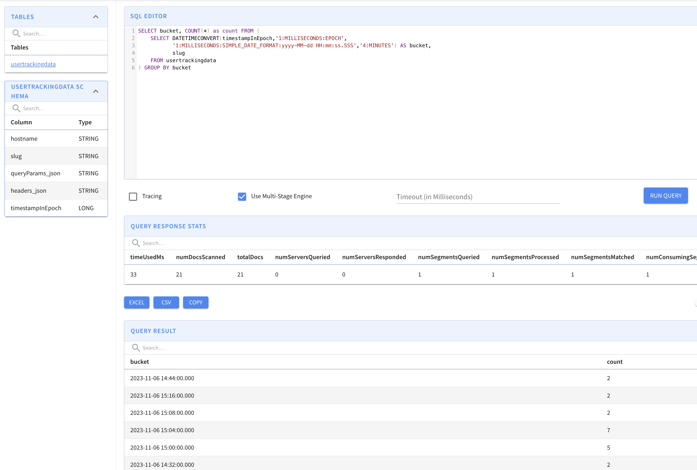

# Pinot Queries

The Pinot query docs are [here](https://docs.pinot.apache.org/users/user-guide-query/querying-pinot).

Gapfilling timeseries data is [here](https://docs.pinot.apache.org/users/user-guide-query/query-syntax/gap-fill-functions)

With the `pinot-db-controller` port-forwarding at port 9000, you can run these queries in the query explorer:



You can also `curl` queries:

```bash
curl -X POST -H "Content-Type: application/json" -d @countQuery.json http://localhost:8099/query/sql
```

Which returns [something like](./example-groupby-response.json):

```json
{
    "resultTable": {
        "dataSchema": {
            "columnNames": [
                "bucket",
                "count"
            ],
            "columnDataTypes": [
                "STRING",
                "LONG"
            ]
        },
        "rows": [
            [ "2023-11-06 14:44:00.000", 2 ],
            [ "2023-11-06 15:16:00.000", 2 ],
            [ "2023-11-06 15:08:00.000", 2 ],
            [ "2023-11-06 15:04:00.000", 7 ],
            [ "2023-11-06 15:00:00.000", 5 ],
            [ "2023-11-06 14:32:00.000", 2 ],
            [ "2023-11-06 15:24:00.000", 1 ],
            [ "2023-11-06 15:28:00.000", 1 ]
        ]
    },
    "requestId": "750013389000000024",
    "stageStats": ...,
    "exceptions": [],
    ...
}
```

With that in place, we can write our first noddy UI!

# Basic Count
```sql
    SELECT * FROM usertrackingdata;
```

# Count into four  minute buckets
```sql
SELECT bucket, COUNT(*) as count FROM (
    SELECT DATETIMECONVERT(timestampInEpoch,'1:MILLISECONDS:EPOCH',
           '1:MILLISECONDS:SIMPLE_DATE_FORMAT:yyyy-MM-dd HH:mm:ss.SSS','4:MINUTES') AS bucket,
           slug
    FROM usertrackingdata
) GROUP BY bucket
```


# Get min / max time
```sql
SELECT MIN(timestampInEpoch) as first, MAX(timestampInEpoch) as last FROM usertrackingdata
```

# Get min / max time as datetime
```sql
SELECT DATETIMECONVERT(first,'1:MILLISECONDS:EPOCH',
           '1:MILLISECONDS:SIMPLE_DATE_FORMAT:yyyy-MM-dd HH:mm:ss.SSS','1:MINUTES') as begin,
           DATETIMECONVERT(last,'1:MILLISECONDS:EPOCH',
           '1:MILLISECONDS:SIMPLE_DATE_FORMAT:yyyy-MM-dd HH:mm:ss.SSS','1:MINUTES') as end FROM (

  SELECT MIN(timestampInEpoch) as first, MAX(timestampInEpoch) as last FROM usertrackingdata
)
```

# GapFill - TODO
```sql
SELECT GAPFILL(timestampInEpoch,'1:MILLISECONDS:SIMPLE_DATE_FORMAT:yyyy-MM-dd HH:mm:ss.SSS','2023-11-06 14:34:00.000',
               '2023-11-06 15:16:00.000','2:MINUTES', FILL(timestampInEpoch, 'FILL_DEFAULT_VALUE'),
               TIMESERIESON(timestampInEpoch))
FROM usertrackingdata
```