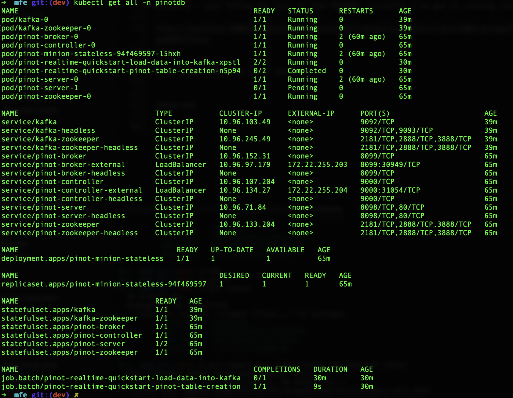

# Pinto

# Local Links
 * [pinot dashboard](http://localhost:9000/#/query?query=select+*+from+airlineStats+limit+10&tracing=false&useMSE=false)

 * [java client](https://docs.pinot.apache.org/users/clients/java)
 * [superset](https://superset.apache.org/)

## Installing
Install via [the docs](https://docs.pinot.apache.org/basics/getting-started/kubernetes-quickstart):

```
helm repo add pinot https://raw.githubusercontent.com/apache/pinot/master/kubernetes/helm
kubectl create ns pinotdb
helm install pinot pinot/pinot \
    -n pinotdb \
    --set cluster.name=pinot \
    --set server.replicaCount=2
```

Actually - just follow the rest of that README. currently I've got it running locally via
```
http://localhost:9000/#/query?query=select+*+from+airlineStats+limit+10&tracing=false&useMSE=false
```

after ingesting from local kafka:





