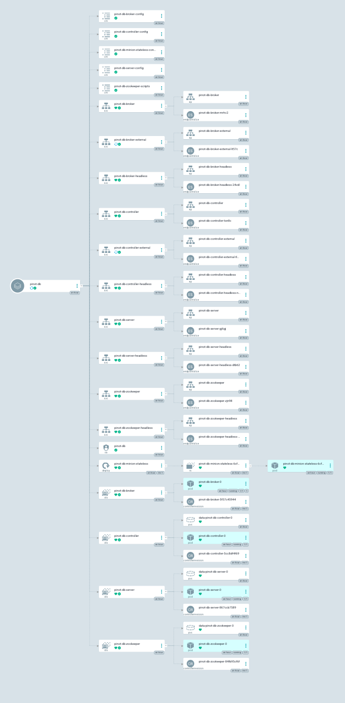

# Pinot

This piece is for installing pinotDB .

You can use `make installArgo` which will deploy pinot to your cluster:




# Appendex - the steps I followed

As per the docs:

```
helm repo add pinot https://raw.githubusercontent.com/apache/pinot/master/kubernetes/helm
kubectl create ns pinot-quickstart
helm install pinot pinot/pinot \
    -n pinot-quickstart \
    --set cluster.name=pinot \
    --set server.replicaCount=2
```


We reference the main helm chart as per [here](https://blog.devops.dev/stop-cloning-helm-charts-enough-b40fb5d67ac7)

```
helm create data-mesh-pinot
# added dependency on pinot chart
helm repo update
helm dependency update

# then
helm install data-mesh-pinot .
```

