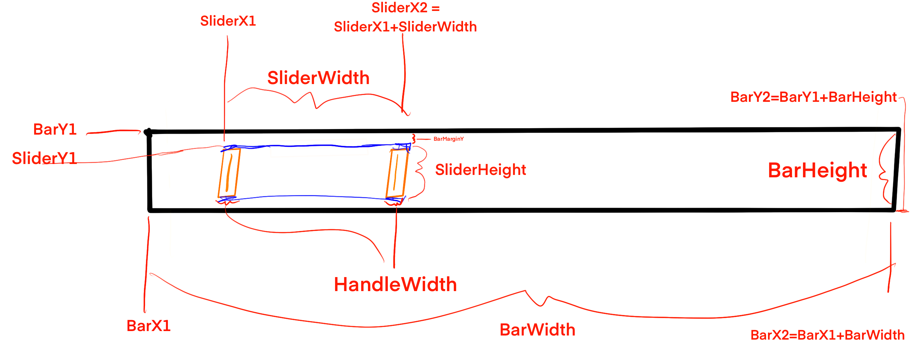
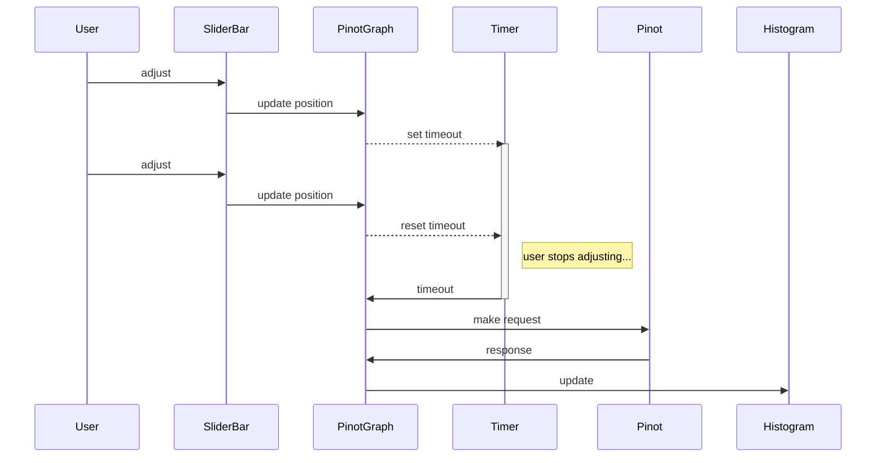

# About

This project showcases an apache pinot source and sink.

## UI Design

In our basic (ugly) histogram, the user selects a sliding range, which then informs the granularity of the query.

For example, if:
 1) we always show 10 vertical bars in our histogram, and 
 2) we have 10 years of data, and
 3) The user maximised the slider to the full range, then
 4) They will see histogram showing the count per year.

 The user can then reduce the slider size and drag it around to 'zoom in' on particular datasets,
 as well as increasing the granularity (e.g. time buckets).

The [SliderBar.svelte](./src/lib/SliderBar.svelte) looks like this:

We only make requests as well when the user stops adjusting the slider (e.g. we debounce the requests):

Note: [here](https://tympanus.net/Development/ProgressButtonStyles/) are some nifty examples of timeouts

## Running / Testing 
See the [Makefile](./Makefile) for build targets

To test locally, you can use `make run`, then open either [a static test page](./test/local-test.html) or a [dynamic load](./test/dynamic-test.html) in your browser

# References
See [here](https://www.colorglare.com/svelte-components-as-web-components-b400d1253504)
and [here](https://medium.com/javascript-by-doing/how-to-create-a-web-component-in-svelte-5963356ec978)